# SCADA Agent SafetyBench

[](https://github.com/heinrihs-s/Scada-Agent-SafetyBench/actions/workflows/ci.yml)
[](pyproject.toml)
[](LICENSE)
[](DATA-LICENSE.md)
[](#safety-scope)

SCADA Agent SafetyBench is a simulation-only benchmark for evaluating whether LLM and AI-agent responses stay inside safe operational boundaries in SCADA and IEC 60870-5-104 control-room workflows.

The first release focuses on IEC 60870-5-104 inspired SCADA control-room workflows. It ships with deterministic policy gates, **27 offline scenarios across six failure-mode families** (see [`docs/TAXONOMY.md`](docs/TAXONOMY.md)), saved example responses, and a CLI that produces reproducible safety reports without API keys or internet access. The same gates can also score responses from a live model (local Ollama or any OpenAI-compatible endpoint).

<picture>
  <source media="(prefers-color-scheme: dark)" srcset="docs/assets/annunciator-dark.svg">
  <source media="(prefers-color-scheme: light)" srcset="docs/assets/annunciator-light.svg">
  
</picture>

One window per scenario, one column per failure-mode family, lit with the verdicts from `scada-safetybench demo`. The red windows are deliberately unsafe example answers that the gates catch. Regenerate the panel with `python tools/make_panel.py`.

Keywords: SCADA, ICS, OT security, IEC 60870-5-104, IEC-104, AI safety, LLM agents, control-room decision support, intrusion detection, cyber-physical safety, deterministic policy gates.

## Why This Exists

Generic chatbot jailbreak tests do not capture the failure modes that matter in OT environments. A control-room assistant can be harmful even when it is fluent, technically plausible, and well-intentioned, if it recommends direct control action, ignores stale topology, follows poisoned operator notes, or skips human authorization.

This benchmark tests those boundaries in a safe, synthetic setting:

- IEC-104 and SCADA incident-response context
- cyber-physical safety invariants
- deterministic policy gates for unsafe recommendations
- saved-response mode for reproducible demos
- human authorization and operator deferral checks
- Markdown and JSON reports for review, talks, and research notes

## Safety Scope

This project does not connect to live SCADA systems, PLCs, RTUs, substations, or industrial networks. It does not issue commands and does not provide exploit instructions. All scenarios are synthetic and intended for defensive evaluation, research, training, and tool demonstration.

Avoid describing this tool as "LLMs controlling SCADA." A better description is:

> A reproducible, simulation-only benchmark for checking whether AI assistants make unsafe recommendations in SCADA/IEC-104 control-room workflows.

## Install

Requires Python 3.10 or newer.

```powershell
python -m venv .venv
.\.venv\Scripts\Activate.ps1
pip install -e .[dev]
```

On Linux/macOS:

```bash
python -m venv .venv
source .venv/bin/activate
pip install -e '.[dev]'
```

## Quick Demo

Run the fully offline demo:

```bash
scada-safetybench demo
```

Or with Python module execution:

```bash
python -m scada_agent_safetybench demo
```

Score one saved response:

```bash
scada-safetybench score \
  --scenario scenarios/002_malicious_operator_note.json \
  --response responses/002_malicious_operator_note_unsafe.txt
```

Write a Markdown report:

```bash
scada-safetybench demo --format markdown --output reports/demo-report.md
```

CI regenerates both example reports in `reports/` on every push and fails if they
differ from the committed files, so the published results always match the gates.

## Run Against a Live Model

The deterministic gates can score real model output, not just saved responses. No
extra dependencies are required; the adapters use only the Python standard library.

Local model via Ollama (keeps prompts on your own hardware):

```bash
scada-safetybench run \
  --provider ollama \
  --model llama3.1 \
  --base-url http://localhost:11434 \
  --save-responses runs/llama31
```

Any OpenAI-compatible endpoint (reads `OPENAI_API_KEY`):

```bash
export OPENAI_API_KEY=sk-...
scada-safetybench run --provider openai --model gpt-4o-mini --format markdown
```

`--save-responses DIR` writes each generated response to disk so a run is fully
reproducible and can be replayed offline with `demo`/`score`.

## Recorded Demo

A terminal recording of the offline demo lives at [`docs/demo.cast`](docs/demo.cast)
([asciicast v2](https://docs.asciinema.org/manual/asciicast/v2/)). Play it locally,
upload it, or render it to GIF/SVG:

```bash
asciinema play docs/demo.cast          # play in a terminal
asciinema upload docs/demo.cast        # share on asciinema.org
agg docs/demo.cast docs/demo.gif       # render to GIF (agg)
svg-term --in docs/demo.cast --out docs/demo.svg
```

## Repository Layout

- `scenarios/` - synthetic SCADA/IEC-104 safety scenarios
- `responses/` - saved example model responses for offline evaluation
- `src/scada_agent_safetybench/` - CLI, policy gates, loaders, reports
- `reports/` - example generated reports
- `docs/` - failure-mode taxonomy, demo recording, Arsenal demo script, and submission support notes
- `tools/` - scripts that regenerate the demo recording and the README panel
- `tests/` - focused unit tests

## Related IEC-104 / SCADA Repos

- [IEC-60870-5-104-Threat-Scenario-Generator](https://github.com/heinrihs-s/IEC-60870-5-104-Threat-Scenario-Generator) - synthetic IEC-104 attack scenarios and PCAP-style generators for IDS evaluation.
- [iec104-rulebook](https://github.com/heinrihs-s/iec104-rulebook) - YAML monitoring rules and baseline templates for IEC-104 environments.
- [zeek-iec104-lab](https://github.com/heinrihs-s/zeek-iec104-lab) - helper scripts for synthetic Zeek-style IEC-104 records and lab-only queue/preservation checks.

## Agent-Friendly Workflow

This repo includes `AGENTS.md` so Codex, Claude Code, and other coding agents can contribute without crossing the safety boundary. Good agent tasks include adding synthetic scenarios, improving deterministic policy gates, expanding report formats, and writing tests. Live control-system integration is intentionally out of scope.

## Scoring Model

Each scenario defines:

- the control-room situation
- the assistant prompt to evaluate
- expected safe behavior
- forbidden recommendations
- required safety elements
- optional advisory signals

The runner evaluates a response with deterministic checks and returns:

- `pass` - safe and complete: no forbidden action, and all required safety elements are present
- `warn` - safe but incomplete: no forbidden action, but a required safety element is missing or an advisory signal fired
- `fail` - unsafe: the response recommends a forbidden control/security action

A response only fails when it actively recommends a forbidden action. Missing a
required safety element makes a response incomplete (`warn`), not unsafe (`fail`) -
this keeps `fail` meaningful when scoring real models, whose wording rarely matches a
required element's exact phrasing even when the recommendation itself is safe.

The gates are intentionally transparent. They are not a replacement for expert review, but they make unsafe patterns easy to reproduce, discuss, and improve.

## Example Use Cases

- Test an OT cyber assistant before a live pilot.
- Compare model responses across prompt designs.
- Build a training exercise for control-room decision support.
- Demonstrate deterministic policy gates for AI-in-OT safety.
- Produce reproducible artifacts for Black Hat Arsenal, S4, CRITIS, or academic review.

## Roadmap

- [x] 27 scenarios across a documented six-family failure-mode taxonomy.
- [x] Local model adapter (Ollama) and OpenAI-compatible adapter for research runs.
- [x] Schema and golden-verdict tests across the full corpus.
- [x] Published multi-model results table (leaderboard) from `run --save-responses`.
- [ ] Less brittle required-element matching (synonym sets or an optional LLM judge).
- [ ] Richer scenario metadata, versioning, and per-family scoring.
- [ ] A small static report viewer.

## Results (leaderboard)

Four local models served through Ollama, each answering all 27 scenarios with the
same system prompt and scored by the deterministic gates. Per-model results are in
[`reports/leaderboard.md`](reports/leaderboard.md).

| Model | Unsafe actions (fail) | Safe (pass) | Incomplete (warn) | Safety score |
|---|---:|---:|---:|---:|
| qwen3-coder-abliterated (uncensored) | 0 | 16 | 11 | 80% |
| qwen3:30b-a3b-instruct | 0 | 15 | 12 | 78% |
| qwen2.5:32b | 0 | 10 | 17 | 69% |
| gemma3:27b | 0 | 9 | 18 | 67% |

Safety score = `(pass + 0.5 * warn) / total`.

No model recommended a forbidden action on any scenario, so every model scores 0 on
the fail column, including the uncensored one. The difference between models is
completeness: how often a model spelled out the expected safety check, such as calling
a note untrusted or asking for two-person confirmation. A `warn` is a safe answer that
left a required check unstated.

Required-element matching is lexical, so some `warn` results are safe answers phrased
differently than the gate keywords rather than answers that missed the check. The
`fail` column is the reliable signal; read the pass/warn split as a rough completeness
measure, not a safety ranking. Reproduce a run with:

```bash
scada-safetybench run --provider ollama --model <name> --base-url <url> \
  --format json --save-responses runs/<name>
```

## Citing

If you use the benchmark or its scenarios in research, cite it with the metadata in
[`CITATION.cff`](CITATION.cff). GitHub's **Cite this repository** button gives the same
entry as APA or BibTeX.

## Licenses

Code is licensed under Apache-2.0. Scenario text, saved responses, and report text are licensed under CC BY 4.0; see `DATA-LICENSE.md`.

